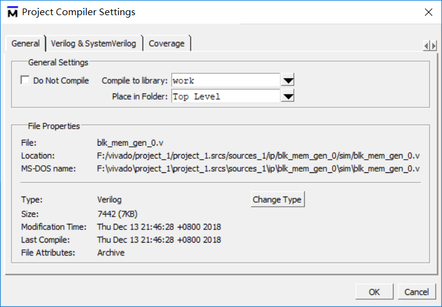
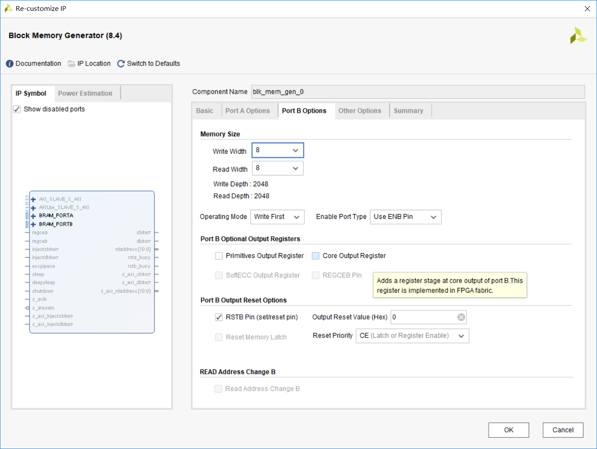
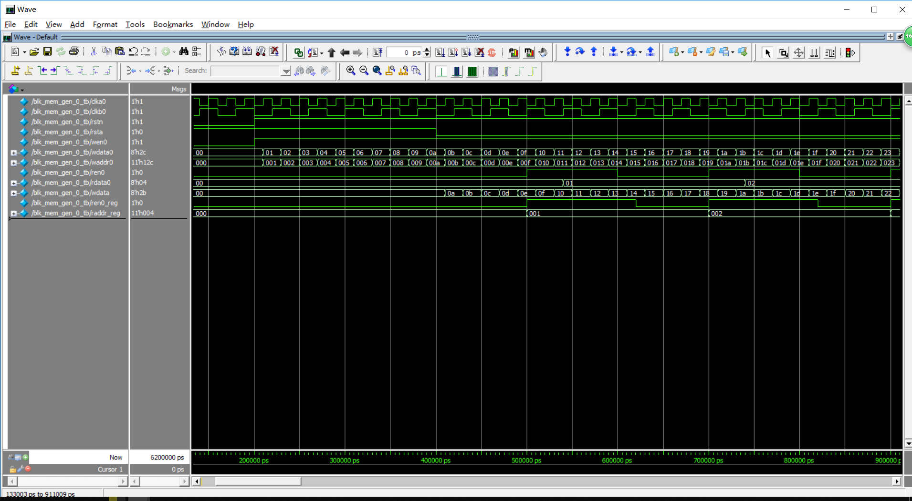
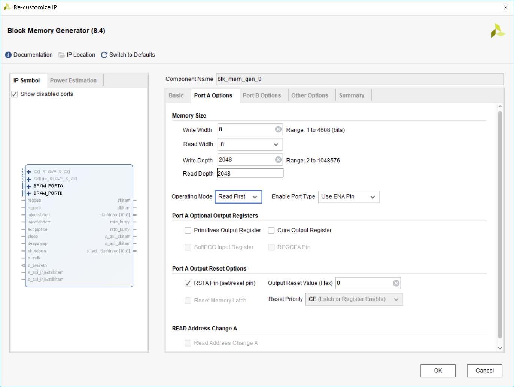
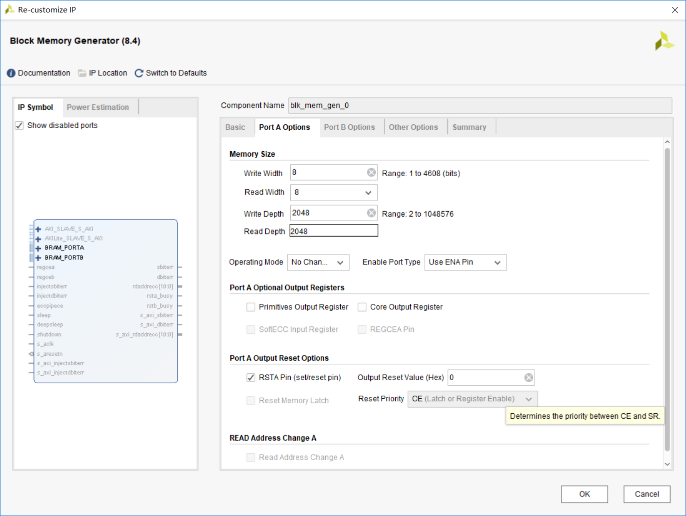
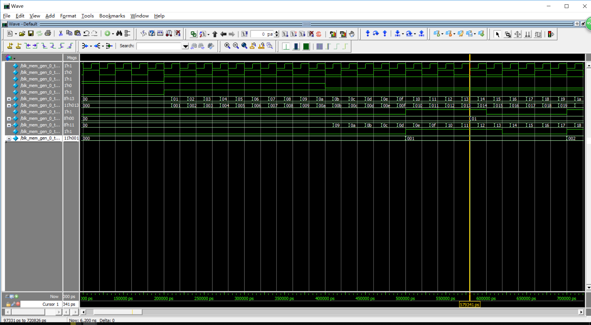
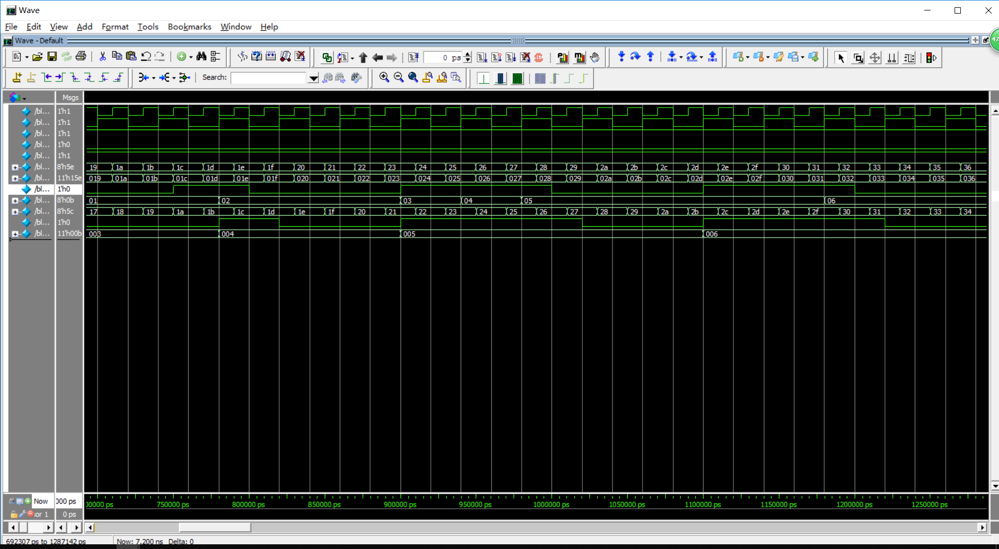

### 需要在modelsim中添加的文件



1. bram在project只要添加这一个路径的文件即可。
2. simulate时记得添加library。
3. modelsim的项目中的mpf记得合并器件库的ini。

# vivado设置

* rst是1复位，0模块使能

## True Dual Port RAM

### 第一次测试的设置







1. port A的输出比输入延迟一个clk
2. port B的输出比地址输入延迟一个周期

​ 

```verilog
`timescale 10ns/10ns

module blk_mem_gen_0_tb;

  reg           clka0;
  reg           clkb0;
  reg           rstn;
  reg           rsta;

  reg           wen0;
  reg   [7:0]   wdata0;
  reg   [10:0]  waddr0;

  reg           ren0;
  wire  [7:0]   rdata0;
  wire  [7:0]   wdata;

  initial begin
    clka0 = 1'b0;
    clkb0 = 1'b0;
    rstn  = 1'b0;
    rsta  = 1'b1;

    wen0  = 1'b0;
    wdata0= 8'h00;
    waddr0= 11'h000;

    ren0  = 1'b0;

    #20;
    rstn  = 1'b1;
    wen0  = 1'b1;
    #20;
    rsta  = 1'b0;    
    #10;
    ren0  = 1'b1;
    #10;
    ren0  = 1'b0;
    #10;
    ren0  = 1'b1;
    #10;
    ren0  = 1'b0;
    #10;
    ren0  = 1'b1;
    #10;
    ren0  = 1'b0;
    #10;
    ren0  = 1'b1;
    #10;
    ren0  = 1'b0;
    
    #500 $stop;
  end

  reg ren0_reg;
  reg [10:0] raddr_reg;

  always #1 clka0 = ~clka0;
  always #2 clkb0 = ~clkb0;
  
  always @(posedge clka0 or negedge rstn) begin
    if(!rstn) begin
      wdata0 <= 8'h00;
      waddr0 <= 11'h000;
    end
    else begin
      waddr0 <= waddr0 + 1'b1;
      wdata0 <= wdata0 + 1'b1;
    end
  end

  always @(posedge clkb0 or negedge rstn) begin
    if(!rstn) ren0_reg <= 1'b0;
    else      ren0_reg <= ren0;
  end

  always @(posedge clkb0 or negedge rstn) begin
    if(!rstn) raddr_reg <= 11'h000;
    else if(ren0_reg == 1'b0 && ren0 == 1'b1) begin
      if(raddr_reg == 11'd2047) raddr_reg <= 11'd0;
      else                      raddr_reg <= raddr_reg + 1'b1;
    end
  end

  blk_mem_gen_0 u_blk_mem_gen_0
  (
    .clka   ( clka0       ),
    .ena    ( wen0        ),
    .wea    ( wen0        ),
    .addra  ( waddr0      ),
    .dina   ( wdata0      ),
    .douta  ( wdata       ),
    .rsta   ( rsta        ),

    .enb    ( ren0        ),
    .clkb   ( clkb0       ),
    .addrb  ( raddr_reg   ),
    .doutb  ( rdata0      ),
    .rstb   ( rsta        )
  );
endmodule 
```

 ### 当Port A改变read first




可以看到wdata没了，也就是说port A的输出没了

### 当port A改变no change



仿真图和read first一样

### 当两个口都添加了primitives output register



可以看到，两个口的输出都比出来的多延迟一个时钟

这时，如果改testbench的话

```verilog
`timescale 10ns/10ns

module blk_mem_gen_0_tb;

  reg           clka0;
  reg           clkb0;
  reg           rstn;
  reg           rsta;

  reg           wen0;
  reg   [7:0]   wdata0;
  reg   [10:0]  waddr0;

  reg           ren0;
  wire  [7:0]   rdata0;
  wire  [7:0]   wdata;

  initial begin
    clka0 = 1'b0;
    clkb0 = 1'b0;
    rstn  = 1'b0;
    rsta  = 1'b1;

    wen0  = 1'b0;
    wdata0= 8'h00;
    waddr0= 11'h000;

    ren0  = 1'b0;

    #20;
    rstn  = 1'b1;
    wen0  = 1'b1;
    rsta  = 1'b0;    
    #10;
    ren0  = 1'b1;
    #5;
    ren0  = 1'b0;
    #10;
    ren0  = 1'b1;
    #5;
    ren0  = 1'b0;
    #10;
    ren0  = 1'b1;
    #5;
    ren0  = 1'b0;
    #10;
    ren0  = 1'b1;
    #5;
    ren0  = 1'b0;
    #10;
    ren0  = 1'b1;
    #10;
    ren0  = 1'b0;
    #10;
    ren0  = 1'b1;
    #10;
    ren0  = 1'b0;
    #10;
    ren0  = 1'b1;
    #10;
    ren0  = 1'b0;
    #10;
    ren0  = 1'b1;
    #10;
    ren0  = 1'b0;
    #10;
    ren0  = 1'b1;
    #10;
    ren0  = 1'b0;
    #10;
    ren0  = 1'b1;
    #10;
    ren0  = 1'b0;
    #10;
    ren0  = 1'b1;
    #10;
    ren0  = 1'b0;
    
    #500 $stop;
  end

  reg ren0_reg;
  reg [10:0] raddr_reg;

  always #1 clka0 = ~clka0;
  always #2 clkb0 = ~clkb0;
  
  always @(posedge clka0 or negedge rstn) begin
    if(!rstn) begin
      wdata0 <= 8'h00;
      waddr0 <= 11'h000;
    end
    else begin
      waddr0 <= waddr0 + 1'b1;
      wdata0 <= wdata0 + 1'b1;
    end
  end

  always @(posedge clkb0 or negedge rstn) begin
    if(!rstn) ren0_reg <= 1'b0;
    else      ren0_reg <= ren0;
  end

  always @(posedge clkb0 or negedge rstn) begin
    if(!rstn) raddr_reg <= 11'h000;
    else if(ren0_reg == 1'b0 && ren0 == 1'b1) begin
      if(raddr_reg == 11'd2047) raddr_reg <= 11'd0;
      else                      raddr_reg <= raddr_reg + 1'b1;
    end
  end

  blk_mem_gen_0 u_blk_mem_gen_0
  (
    .clka   ( clka0       ),
    .ena    ( wen0        ),
    .wea    ( wen0        ),
    .addra  ( waddr0      ),
    .dina   ( wdata0      ),
    .douta  ( wdata       ),
    .rsta   ( rsta        ),

    .enb    ( ren0        ),
    .clkb   ( clkb0       ),
    .addrb  ( raddr_reg   ),
    .doutb  ( rdata0      ),
    .rstb   ( rsta        )
  );
endmodule 
```




可以看到，如果ren的信号不足两个周期的话，会延迟足够两个周期再输出

# 存在问题

* 为什么port B的输出从1开始，明明什么都没输入。
* 如何做到reset之后，waddr ==  0 时，能输出addr = 0 的数据。