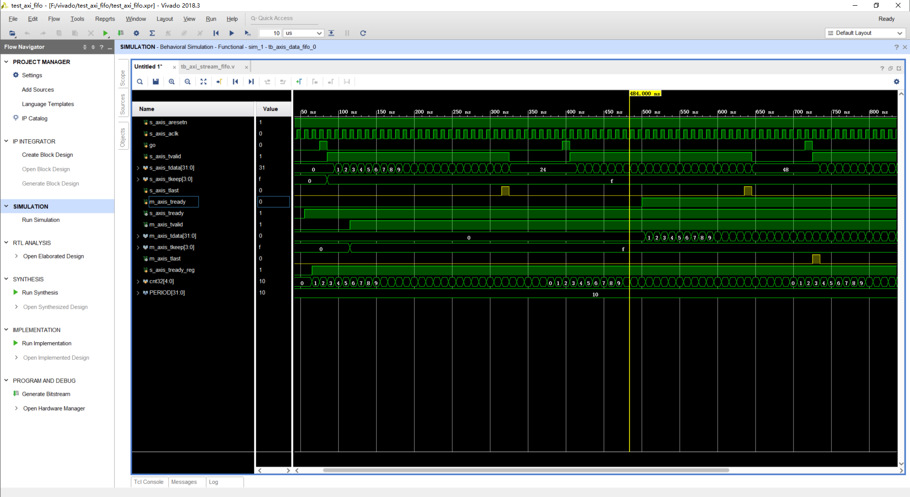

# xilinx_axis_fifo_ip

[仿真代码](tb_axi_stream_fifo.v)

仿真结果，当`#(PERIOD*7) m_axis_tready = 1;`时，如图：

当`#(PERIOD*50) m_axis_tready = 1;`时，如图：

值得注意的是，当输入到最后一个时，如果，fifo空了，则 `m_axis_tlast`会持续到下一个数据进入才下降；否则，只会持续一个时钟。
