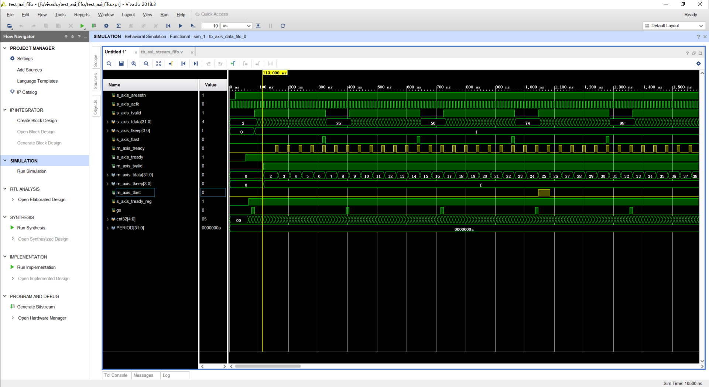
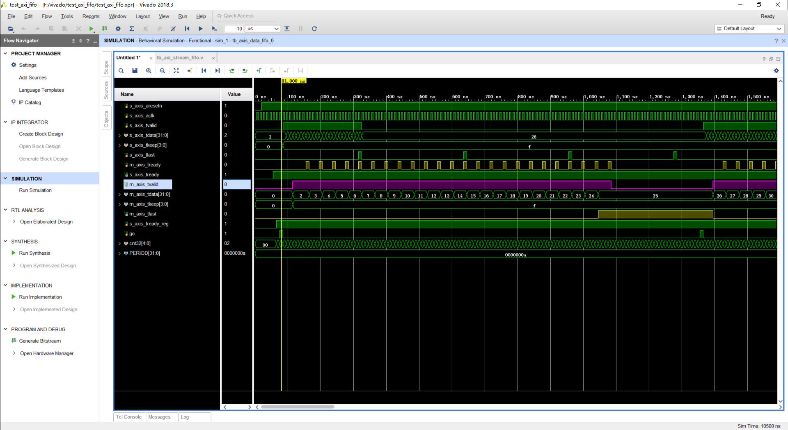

# xilinx_axis_fifo_ip

[仿真代码](tb_axi_stream_fifo.v)

仿真结果，当`#(PERIOD*7) m_axis_tready = 1;`时，如图：

当`#(PERIOD*50) m_axis_tready = 1;`时，如图：

值得注意的是，当输入到最后一个时，如果，fifo空了，则 `m_axis_tlast`会持续到下一个数据进入才下降；否则，只会持续一个时钟。

修改代码，使m_axis_tready每4个时钟给一个脉冲信号，并且m_axis_tready在m_axis_tvalid信号为1时才给信号，得[代码2](tb_axi_stream_fifo_2.v),仿真后可以看到如图：

可以看到，当fifo被写入信号之后，m_axis_tvaild会被置1，同时m_axis_tdata会写出fifo写入的第一个数据；当读到s_axis_tlast所指定的最后一个数据时，m_axis_tlast会一直置1直到下一个数据读取信号。

同时，在下图中可以看出，m_axis_mvalid在fifo空时，是可以置0的。

