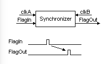
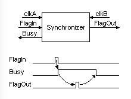
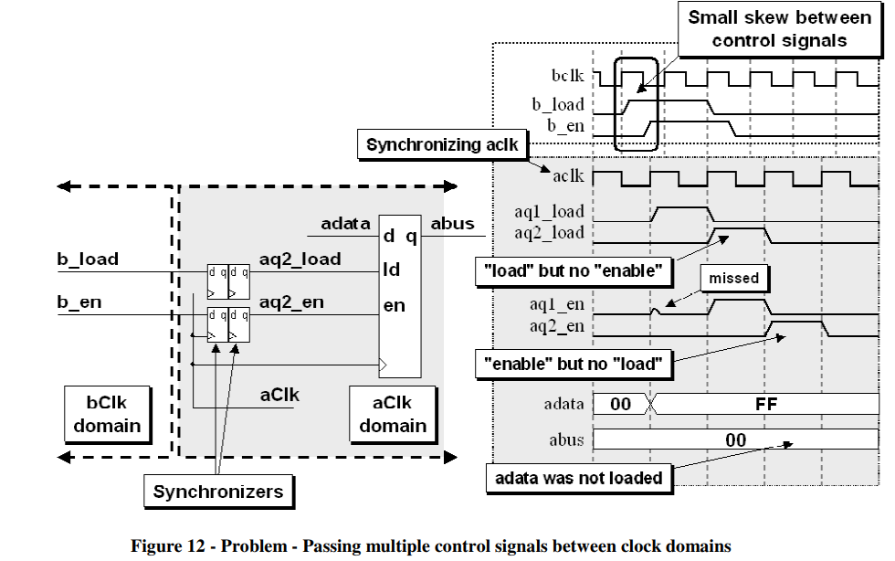
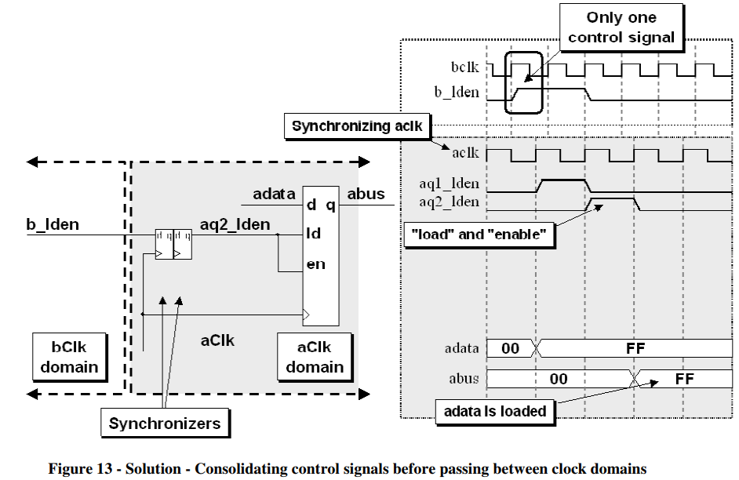
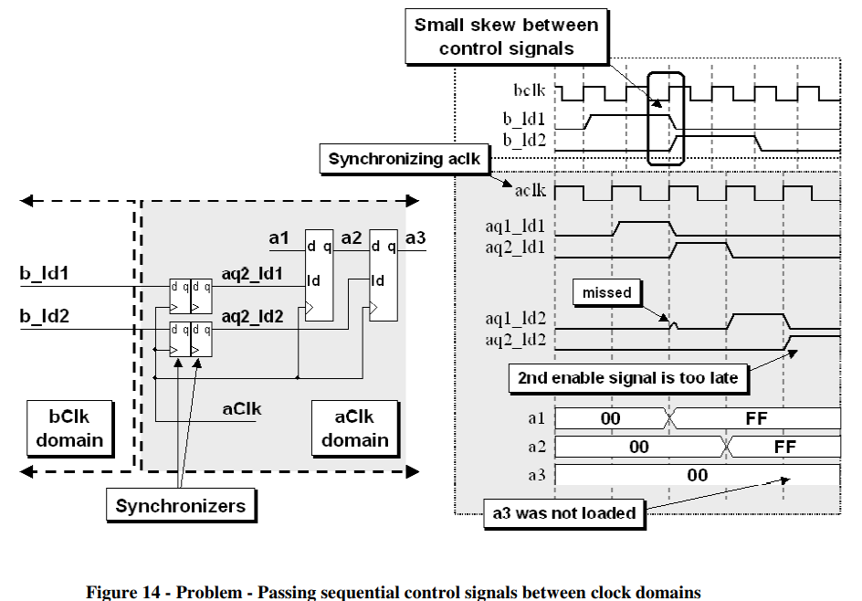
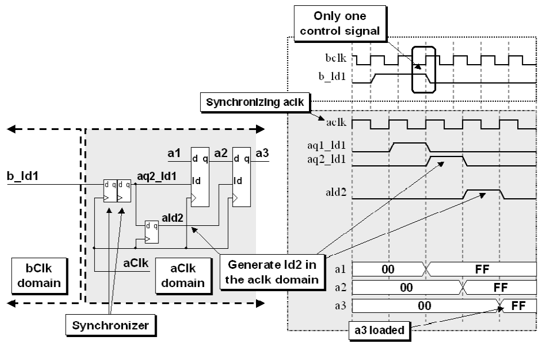
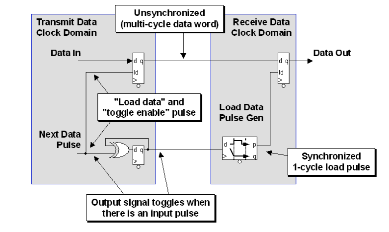
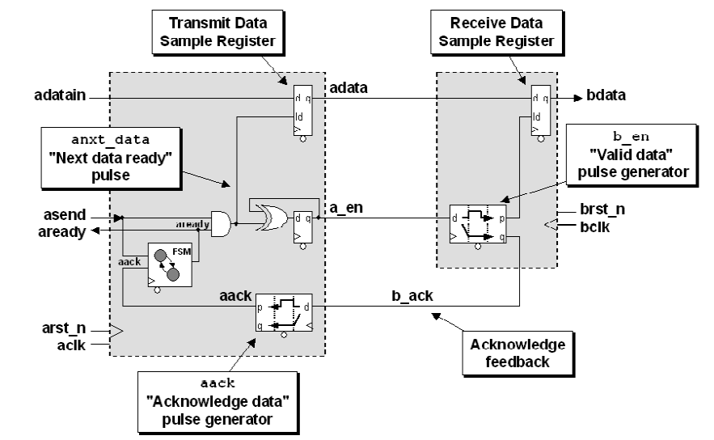
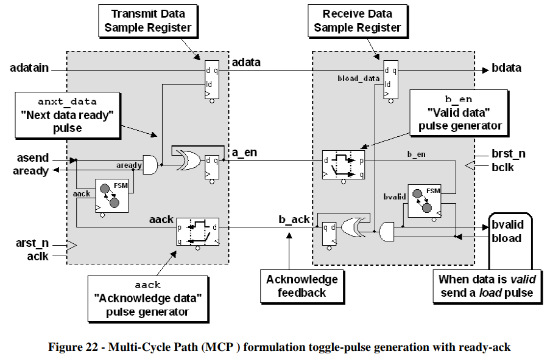
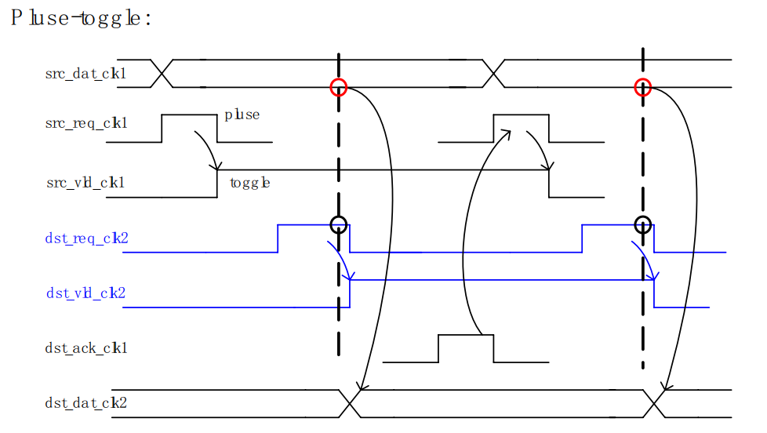

[TOC]

# Crossing clock domains

## 亚稳态

​		每一个触发器都有其规定的建立(setup)和保持(hold)时间参数, 在这个时间参数内， 输入信号在时钟的上升沿是不允许发生变的。 如果在信号的建立时间中对其进行采样， 得到的结果将是不可预知的，即亚稳态。

​		触发器进入亚稳态的时间可以用参数 MTBF(mean time between failures)来描述， MTBF即触发器采样失败的时间间隔，其公式描述如下：
$$
MTBF = \frac{e^{t_{r}\tau}}{T_{0}fa}
$$
其中：

$ t_{r}$ :分辨时间（时钟沿开始）

$ \tau, T_{0}$ : 触发器参数

$ f$: 采样时钟频率

$ a$ = 异步事件出发频率 

## Signal

​	在第一个设计中，我们假设“信号输入”与clkA和clkB时钟速度相比变化缓慢。
​	您需要做的就是使用两个触发器将信号从clkA移动到clkB

```verilog
module Signal_CrossDomain(
    input clkA,   
    input SignalIn_clkA,
    input clkB,
    output SignalOut_clkB
);

// We use a two-stages shift-register to synchronize SignalIn_clkA to the clkB clock domain
reg [1:0] SyncA_clkB;
always @(posedge clkB) SyncA_clkB[0] <= SignalIn_clkA;   
always @(posedge clkB) SyncA_clkB[1] <= SyncA_clkB[0];   

assign SignalOut_clkB = SyncA_clkB[1];  
endmodule
```

## Flag



```verilog
module Flag_CrossDomain(
    input clkA,
    input FlagIn_clkA,   // this is a one-clock pulse from the clkA domain
    input clkB,
    output FlagOut_clkB   // from which we generate a one-clock pulse in clkB domain
);

reg FlagToggle_clkA;
always @(posedge clkA) FlagToggle_clkA <= FlagToggle_clkA ^ FlagIn_clkA;  // when flag is asserted, this signal toggles (clkA domain)

reg [2:0] SyncA_clkB;
always @(posedge clkB) SyncA_clkB <= {SyncA_clkB[1:0], FlagToggle_clkA};  // now we cross the clock domains

assign FlagOut_clkB = (SyncA_clkB[2] ^ SyncA_clkB[1]);  // and create the clkB flag
endmodule
```



```verilog
module FlagAck_CrossDomain(
    input clkA,
    input FlagIn_clkA,
    output Busy_clkA,
    input clkB,
    output FlagOut_clkB
);

reg FlagToggle_clkA;
always @(posedge clkA) FlagToggle_clkA <= FlagToggle_clkA ^ (FlagIn_clkA & ~Busy_clkA);

reg [2:0] SyncA_clkB;
always @(posedge clkB) SyncA_clkB <= {SyncA_clkB[1:0], FlagToggle_clkA};

reg [1:0] SyncB_clkA;
always @(posedge clkA) SyncB_clkA <= {SyncB_clkA[0], SyncA_clkB[2]};

assign FlagOut_clkB = (SyncA_clkB[2] ^ SyncA_clkB[1]);
assign Busy_clkA = FlagToggle_clkA ^ SyncB_clkA[1];
endmodule
```

## 多比特同步策略

经常会遇到多个比特的控制信号或者数据信号跨时钟域传输的问题，解决这类问题的出发点主要有：

* 尽可能将这些信号合并成单bit
* Multi-cycle path （MCP). 使用同步信号。
* 使用Gray码

### 控制信号多比特同步

1. 例如下面的例子，load和en作为两个控制信号需要跨时钟同步。两个信号可能需要同时拉高才能正确操作，但是实际同步时可能两者存在一定skew，导致再同步域两级reg同步后两个信号错开，导致控制失败：



这种解决办法也很简单，只要将他们合并成一个即可：



2. 这种情况下，如果两个信号隔开固定的相位，在传输过程中可能会有一定偏移，则同步时也会导致下面的问题：

   

   可见，ld2信号和ld1信号的相位间隔被改变了，而这通常不是我们希望的。解决办法是只传输其中一个信号，另一个信号在同步域内产生。例如上面的例子可以将ld1在B时钟域通过ld1打一拍得到：

   

   

### 数据多比特同步

在数据的多比特传输时更要注意skew的问题，如果bit之间有skew，则传输值很可能出错，主要有两类解决方法： 1. Multi-Cycle Path (MCP) formulation 多周期路径规划（名字怪怪的，感觉就是握手机制） 2. FIFO

1. #### 脉冲同步法（开环的结绳法）

   

   1. 在A时钟域产生一组单周期脉冲，其间隔至少需要比B时钟域的**两个**时钟周期大，否则B中无法进行边沿检测。同时这组脉冲也表示了A中数据传送的开始和结束。
   2. 在A时钟域中，两个脉冲被电平翻转器（可以由异或门或者mux+inv构成）将脉冲之间的区域变为一段高电平（结绳toggle)
   3. A中的结绳信号在B中通过边沿产生器翻译为两个单周期脉冲
   4. B中需要由逻辑去监测脉冲并进行信号的采样

2. #### 闭环结绳法

   上面的脉冲同步信号实际上是开环产生的，需要考虑B时钟域的周期宽度。而下面这种闭环方式解决了这个问题：

   

   其具体原理是：

   1. 首先，asend生成一个脉冲，经过结绳、解绳到B中变为另一个脉冲
   2. 该脉冲反馈回A中通过边沿采样变回A中的单周期脉冲（因为这边讨论的是慢采快，所以A总能采到B的单周期脉冲）
   3. 一个简单的FSM接受反馈的脉冲并给出ready信号，表示单次采样结束，A模块可以改变adata的数据了，同时控制asend信号给出一个新的脉冲，代表单次传输结束，结绳解绳到B中后B也接受到了结束脉冲。

   上面的这种方法还是不够完备，因为反馈信号也是单周期脉冲，在上面第二步中可以发现，如果A的频率比B慢，采不到脉冲岂不是僵硬，所以为了通用，慢采快还是快采慢都能适配，干脆在B中也加入A的的结绳以及FSM来控制整个流程，原理图如下：

   

   可见，B中的状态机接收到脉冲后输出valid信号告诉外面B可以采数据了，bload置高，数据开始采样，之后b_ack置高，送入A中产生结束脉冲，结束脉冲返回B中后FSM跳回not valid状态，一次传输结束。

   下面是上面的简陋版本：

   

   其中标明_clk1 的信号表示该信号属于 clk1 时钟域， 同理标明_clk2 的信号表示该信号属于 clk2 时钟域。在两次src_req_clk1 之间被 src_vld_clk1“ 结绳” (pluse2toggle)，在将src_vld_clk1 用双锁存器同步以后， 将该信号转换为 dst_req_clk2(toggle2pluse)。同理，用dst_vld_clk2 将 dst_req_clk2“结绳”， dst_vld_clk2 表明在 clk2 时钟域中， src_dat_clk1 已经可以进行正确采样了。 最后将 dst_vld_clk2 转换为 dst_ack_clk1(synchronizer and toggle2pluse), dst_ack_clk1 表明 src_dat_clk1 已经被 clk2 正确采样了， 此后 clk1 时钟域就可以安全地传输下一个数据了。 可以看出，“结绳法” 关键是将信号结绳以后， 使其保持了足够长的时间，以便另一个时钟可以正确地采样。

   总之：

   * **优点**：“结绳法” 可以解决快时钟域向慢时钟域过渡的问题， 且其适用的范围很广。
   * **缺点**：实现较为复杂，特别是其效率不高，在对设计性能要求较高的场合应该慎用。

3. #### 异步双口RAM+[格雷码](../016gray code)（异步FIFO)

处理多bit数据的跨时钟域，一般采用异步双口RAM。假设我们现在有一个信号采集平台，ADC芯片提供源同步时钟60MHz，ADC芯片输出的数据在60MHz的时钟上升沿变化，而FPGA内部需要使用100MHz的时钟来处理ADC采集到的数据（多bit）。

在这种类似的场景中，我们便可以使用异步双口RAM来做跨时钟域处理。先利用ADC芯片提供的60MHz时钟将ADC输出的数据写入异步双口RAM，然后使用100MHz的时钟从RAM中读出。

但我们读出RAM中的数据时，肯定不是一上电就直接读取，而是要等RAM中有ADC的数据之后才去读RAM。这就需要100MHz的时钟对RAM的写地址进行判断，当写地址大于某个值之后再去读取RAM。

在这个场景中，其实很多人都是使用直接用100MHz的时钟对RAM的写地址进行打两拍的方式，但RAM的写地址属于多bit，如果单纯只是打两拍，那不一定能确保写地址数据的每一个bit在100MHz的时钟域变化都是同步的，肯定有一个先后顺序。如果**在低速的环境中不一定会出错，在高速的环境下就不一定能保证了。所以更为妥当的一种处理方法就是使用格雷码转换。**

多比特利用双寄存器打两拍在高速场合不再适用，而使用格雷码可以将这种多比特变为单比特传输（格雷码每次变化只有一位会变）如果先将RAM的写地址转为格雷码，然后再将写地址的格雷码进行打两拍，之后再在RAM的读时钟域将格雷码恢复成10进制。这种处理就相当于对单bit数据的跨时钟域处理了。

##### 异步FIFO

使用异步双口ram的场合其实用异步fifo也是一样的。

使用场景：在有**大量的数据**需要进行跨时钟域传输， 并且对数据**传输速度**要求比较高的场合 。

一个异步 FIFO 一般由如下部分组成：
1． Memory, 作为数据的存储器；
2． 写逻辑部分，主要负责产生写信号和地址；
3． 读逻辑部分，主要负责产生读信号和地址；
4． 地址比较部分，主要负责产生 FIFO 空、满的标志。

