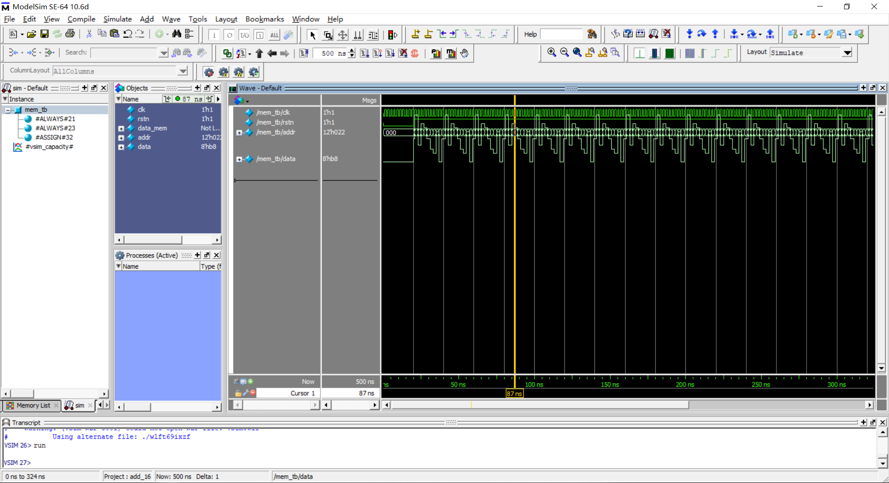
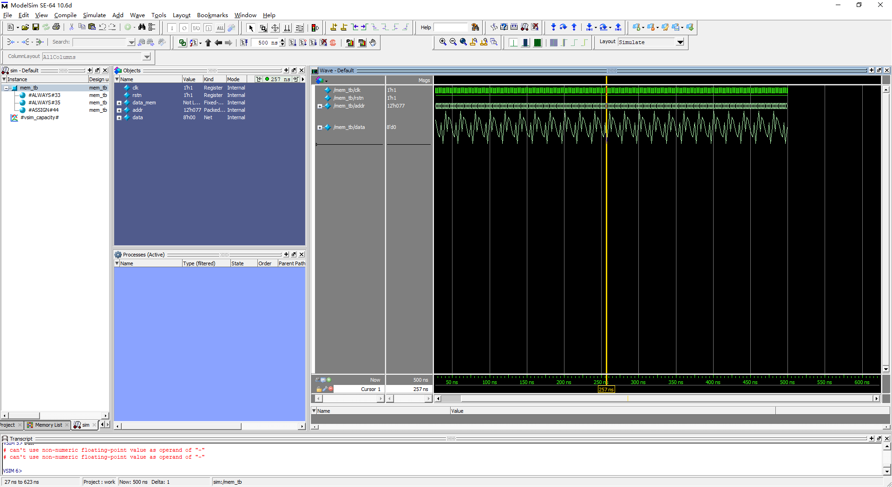
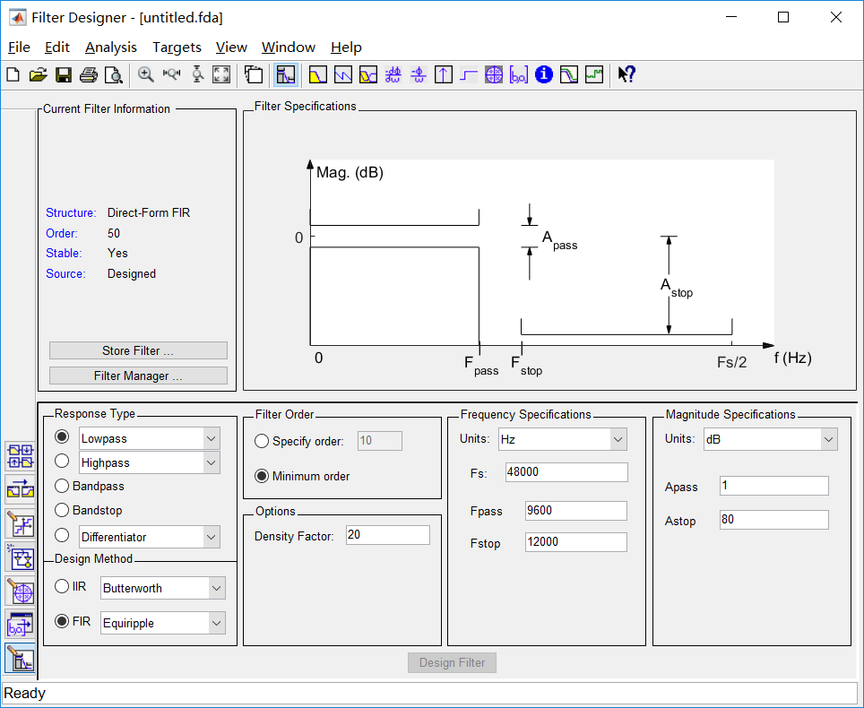
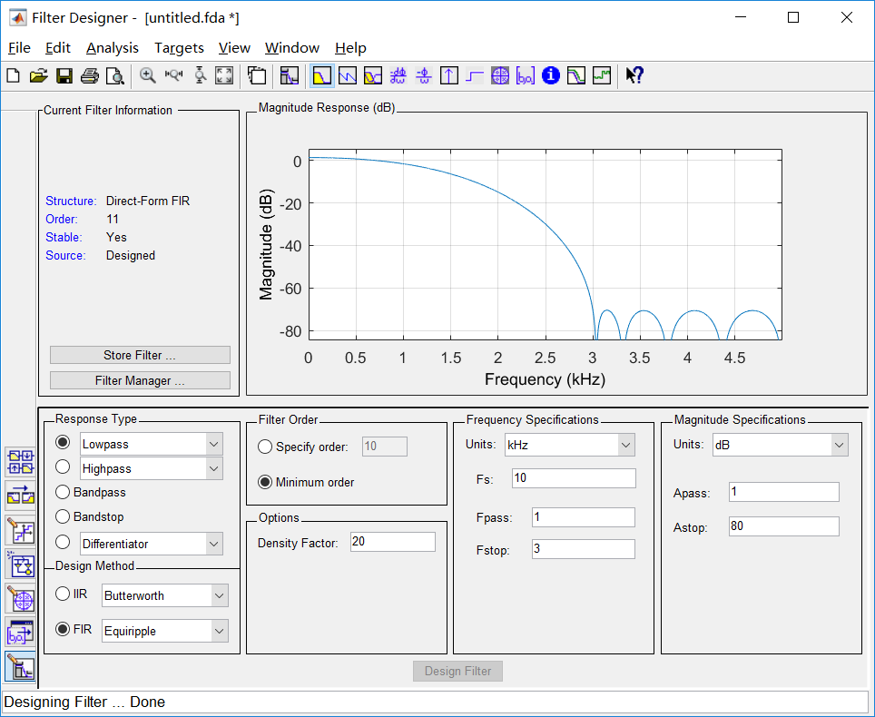
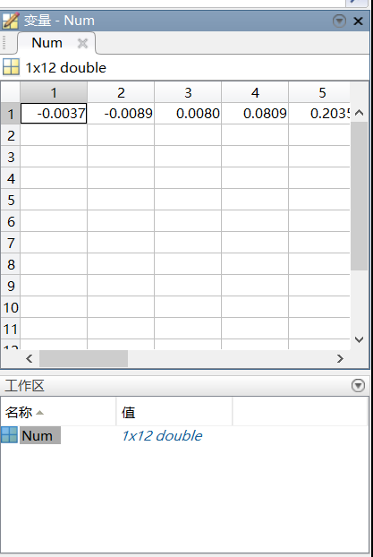
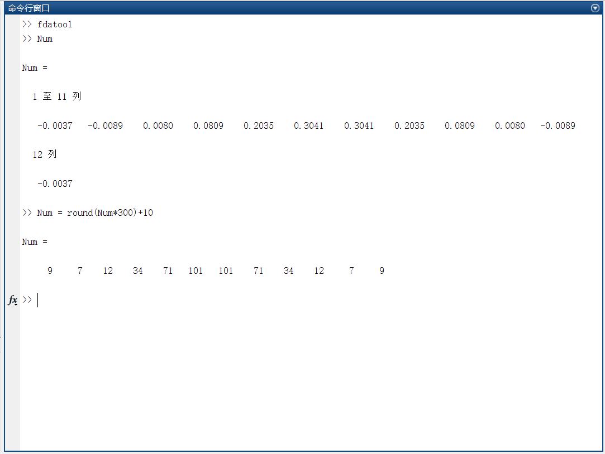
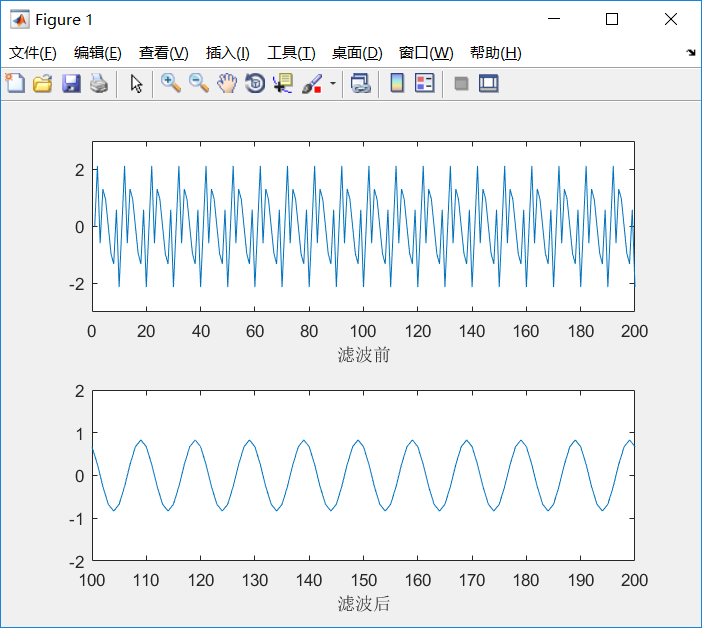
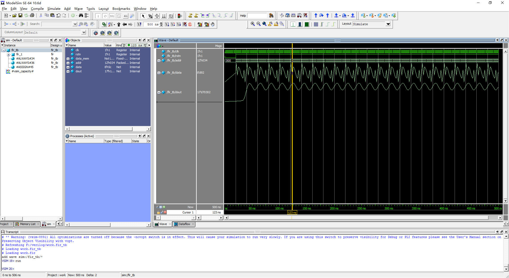

**本文说明如何使用FPGA设计一个低通滤波器**

## matlab

使用matlab写一个混合信号

```matlab
%采样频率
Fs = 10000; 
%采样点数
N = 4096; 
N1 = 0 : 1/Fs : N/Fs-1/Fs;
%三种正弦波 
s = sin(1000*2*pi*N1) + sin(3000*2*pi*N1) + sin(4000*2*pi*N1);
maxs = max(s);
mins = min(s);
%写入文件mem.txt中
%
fidc = fopen('mem.txt','w');
for x = 1 : N
 fprintf(fidc,'%x\n',round(s(x)*120));
end
fclose(fidc);
```

在14行输出的时候，就把s转为无符号整数了

## verilog

这里写了一个testbench直接读取

```verilog
`timescale 1ns/1ns

module mem_tb;

  reg           clk;
  reg           rstn;

  reg   [7:0]   data_mem  [4095:0];
  reg   [11:0]  addr;
  wire  [7:0]   data;

  initial begin
    clk   = 1'b0;
    rstn  = 1'b0;

    #20 rstn = 1'b1;

    $readmemh("F:/verilog/FIR2/mem.txt",data_mem);
  end

  always #1 clk = ~clk;

  always@(posedge clk or negedge rstn) begin
    if(!rstn) begin
      addr <= 11'd0;
    end
    else begin
      addr <= addr + 1'b1;
    end
  end

  assign data = data_mem[addr];

endmodule
```

效果如下图：



##### 其他

1. 如何数据用信号的形式显示出来呢？

我们可以右击想要的信号并且选择Format -> Analog(automatic)即可。

2. verilog代码中，`$readmemh("F:/verilog/FIR2/mem.txt",data_mem);`无法写入相对地址，不知道是否是我操作错误。
3. 如果点Format -> Analog（custom）选择Analog Interpolated，以及Radix -> Unsigned，得：



*此处注意max的值*

## fdatool

这是matlab的一个工具吧应该，在matlab命令行输入fdatool，得：



那么现在使用低通滤波为了把3k4k的信号滤掉，得：



点File -> Export，则matlab有一个名为Num得变量：



可以看到，开头得数据都是负的，而且还是小数，不利于FPGA计算，所以，我们可以把这些数字转成整数：`Num = round(Num*300)+10`：



*注意：这里最好把最小值和最大值控制在一定范围，最小值别太小，最大值别是一下子太大，免得FPGA要写很大的寄存器*

## 使用matlab滤波效果

```matlab
Fs = 10000; 
N = 4096; 
N1 = 0 : 1/Fs :N/Fs-1/Fs;

in =sin(1000*2*pi*N1) + sin(3000*2*pi*N1) + sin(4000*2*pi*N1);
coeff =[-0.0037,-0.0089,0.0080,0.0809,0.2035,0.3041,0.3041,0.2035,0.0809,0.0080,-0.0089,-0.0037];
out =conv(in,coeff);%卷积滤波
subplot(2,1,1);
plot(in);
xlabel('滤波前');
axis([0 200 -3 3]);
subplot(2,1,2);
plot(out);
xlabel('滤波后');
axis([100 200 -2 2]);
```




## 使用fpga滤波

首先代码如下：

```verilog
//==============================================================================
// Module name: fir
// Author     : momo
// E-mail     : 1345238761@qq.com
// Create date: 2019.5.3
// Description: fir design
// -------------------------------------------------
// Modification log here:
// Author     :
// Date       : 
// Message    :
//==============================================================================
module fir 
#(
  localparam IWIDTH   = 8,
  localparam OWIDTH   = 16  
)
(
  input                       clk,
  input                       rstn,
  input       [IWIDTH - 1:0]  din,
  
  output reg  [OWIDTH:0]      dout
);

  reg [IWIDTH - 1:0]  delay1;
  reg [IWIDTH - 1:0]  delay2;
  reg [IWIDTH - 1:0]  delay3;
  reg [IWIDTH - 1:0]  delay4;
  reg [IWIDTH - 1:0]  delay5;
  reg [IWIDTH - 1:0]  delay6;
  reg [IWIDTH - 1:0]  delay7;
  reg [IWIDTH - 1:0]  delay8;
  reg [IWIDTH - 1:0]  delay9;
  reg [IWIDTH - 1:0]  delay10;
  reg [IWIDTH - 1:0]  delay11;
  reg [IWIDTH - 1:0]  delay12;

  reg [IWIDTH - 1:0]  coeff1  = 8'd9;
  reg [IWIDTH - 1:0]  coeff2  = 8'd7;
  reg [IWIDTH - 1:0]  coeff3  = 8'd12;
  reg [IWIDTH - 1:0]  coeff4  = 8'd34;
  reg [IWIDTH - 1:0]  coeff5  = 8'd71;
  reg [IWIDTH - 1:0]  coeff6  = 8'd101;
  reg [IWIDTH - 1:0]  coeff7  = 8'd101;
  reg [IWIDTH - 1:0]  coeff8  = 8'd71;
  reg [IWIDTH - 1:0]  coeff9  = 8'd34;
  reg [IWIDTH - 1:0]  coeff10 = 8'd12;
  reg [IWIDTH - 1:0]  coeff11 = 8'd7;
  reg [IWIDTH - 1:0]  coeff12 = 8'd9;

  reg  [OWIDTH - 1:0]  dmul1;
  reg  [OWIDTH - 1:0]  dmul2;
  reg  [OWIDTH - 1:0]  dmul3;
  reg  [OWIDTH - 1:0]  dmul4;
  reg  [OWIDTH - 1:0]  dmul5;
  reg  [OWIDTH - 1:0]  dmul6;
  reg  [OWIDTH - 1:0]  dmul7;
  reg  [OWIDTH - 1:0]  dmul8;
  reg  [OWIDTH - 1:0]  dmul9;
  reg  [OWIDTH - 1:0]  dmul10;
  reg  [OWIDTH - 1:0]  dmul11;
  reg  [OWIDTH - 1:0]  dmul12;

  //y(n) = h(n)*x(n)
  //输入信号延迟
  always@(posedge clk or negedge rstn) begin
    if(!rstn) begin
      delay1  <= 8'd0;
      delay2  <= 8'd0;
      delay3  <= 8'd0;
      delay4  <= 8'd0;
      delay5  <= 8'd0;
      delay6  <= 8'd0;
      delay7  <= 8'd0;
      delay8  <= 8'd0;
      delay9  <= 8'd0;
      delay10 <= 8'd0;
      delay11 <= 8'd0;
      delay12 <= 8'd0;
    end
    else begin
      delay1  <=  din;
      delay2  <=  delay1;
      delay3  <=  delay2;
      delay4  <=  delay3;
      delay5  <=  delay4;
      delay6  <=  delay5;
      delay7  <=  delay6;
      delay8  <=  delay7;
      delay9  <=  delay8;
      delay10 <=  delay9;
      delay11 <=  delay10;
      delay12 <=  delay11;
    end
  end

  always@(posedge clk or negedge rstn) begin
    if(!rstn) dmul1 <= 16'd0;
    else      dmul1 <= delay1 * coeff1;
  end

  always@(posedge clk or negedge rstn) begin
    if(!rstn) dmul2 <= 16'd0;
    else      dmul2 <= delay2 * coeff2;
  end
  
  always@(posedge clk or negedge rstn) begin
    if(!rstn) dmul3 <= 16'd0;
    else      dmul3 <= delay3 * coeff3;
  end

  always@(posedge clk or negedge rstn) begin
    if(!rstn) dmul4 <= 16'd0;
    else      dmul4 <= delay4 * coeff4;
  end

  always@(posedge clk or negedge rstn) begin
    if(!rstn) dmul5 <= 16'd0;
    else      dmul5 <= delay5 * coeff5;
  end

  always@(posedge clk or negedge rstn) begin
    if(!rstn) dmul6 <= 16'd0;
    else      dmul6 <= delay6 * coeff6;
  end

  always@(posedge clk or negedge rstn) begin
    if(!rstn) dmul7 <= 16'd0;
    else      dmul7 <= delay7 * coeff7;
  end

  always@(posedge clk or negedge rstn) begin
    if(!rstn) dmul8 <= 16'd0;
    else      dmul8 <= delay8 * coeff8;
  end

  always@(posedge clk or negedge rstn) begin
    if(!rstn) dmul9 <= 16'd0;
    else      dmul9 <= delay9 * coeff9;
  end

  always@(posedge clk or negedge rstn) begin
    if(!rstn) dmul10 <= 16'd0;
    else      dmul10 <= delay10 * coeff10;
  end

  always@(posedge clk or negedge rstn) begin
    if(!rstn) dmul11 <= 16'd0;
    else      dmul11 <= delay11 * coeff11;
  end

  always@(posedge clk or negedge rstn) begin
    if(!rstn) dmul12 <= 16'd0;
    else      dmul12 <= delay12 * coeff12;
  end
  
  always@(posedge clk or negedge rstn) begin
    if(!rstn) dout  <= 16'd0;
    else      dout  <=  dmul1+dmul2+dmul3+dmul4+dmul5+dmul6+dmul7+dmul8+dmul9+dmul10+dmul11+dmul12;
  end

endmodule
```

testbench代码如下：

```verilog
//==============================================================================
// Module name: fir_tb
// Author     : momo
// E-mail     : 1345238761@qq.com
// Create date: 2019.5.3
// Description: read mem.txt and run the fir
// -------------------------------------------------
// Modification log here:
// Author     :
// Date       : 
// Message    :
//==============================================================================
`timescale 1ns/1ns

module fir_tb;

  reg           clk;
  reg           rstn;

  reg   [7:0]   data_mem  [4095:0];
  reg   [11:0]  addr;
  wire  [7:0]   data;
  wire  [16:0]  dout;

  initial begin
    clk   = 1'b0;
    rstn  = 1'b0;

    #20 rstn = 1'b1;
    //文件地址按需求更改
    $readmemh("F:/verilog/FIR/mem.txt",data_mem);
  end

  always #1 clk = ~clk;

  always@(posedge clk or negedge rstn) begin
    if(!rstn) begin
      addr <= 11'd0;
    end
    else begin
      addr <= addr + 1'b1;
    end
  end

  assign data = data_mem[addr];

  fir fir_1
  (
    .clk  ( clk   ),
    .rstn ( rstn  ),

    .din  ( data  ),
    .dout ( dout  )
  );

endmodule
```

modelsim仿真效果：



其中，fir.v的第23行，输出reg的width为17位，这个根据实际计算调整位宽。
