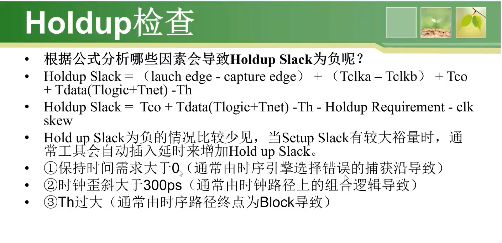

[TOC]

# 时序约束

## 基础知识

### 时序分析

检查设计中所有D触发器是否正常工作。

1. 同步端口（输入）是否满足setup time和hold time；
2. 异步端口（一般是复位）是否满足恢复时间（recovery）和移除时间（removal）；

### 建立/保持时间

$ T_{setup} $: 在clk上升沿到来之前，数据提前一个最小时间量“预先准备好”，这个最小时间量就是建立时间。

$ T_{hold}$ :  在clk上升沿来之后，数据必须保持一个最小时间量“不能变化”，这个最小时间量就是保持时间。

