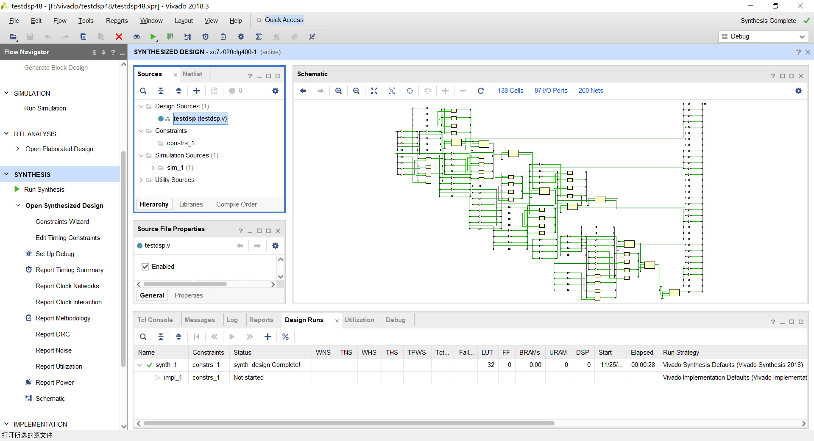
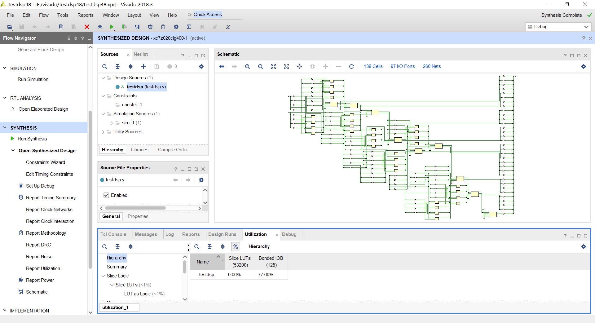
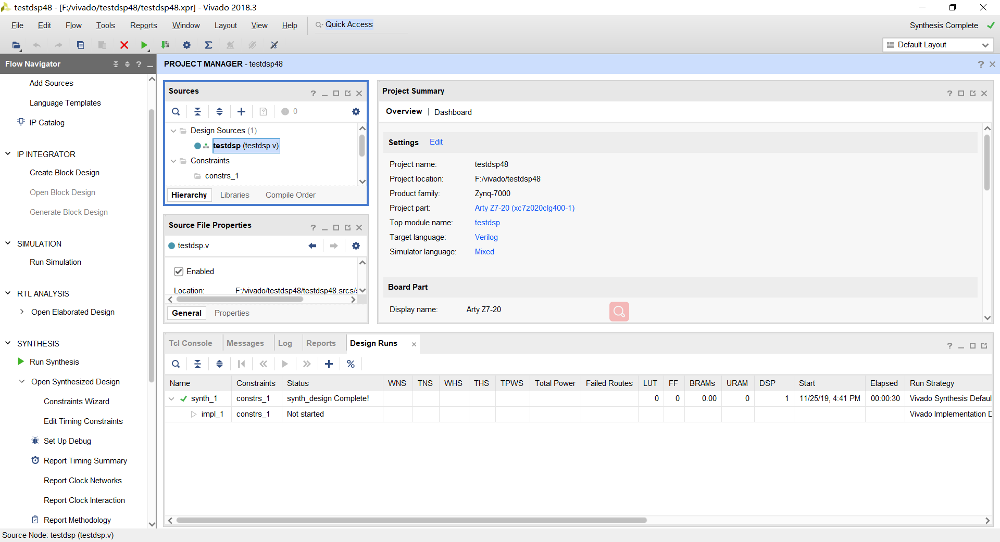
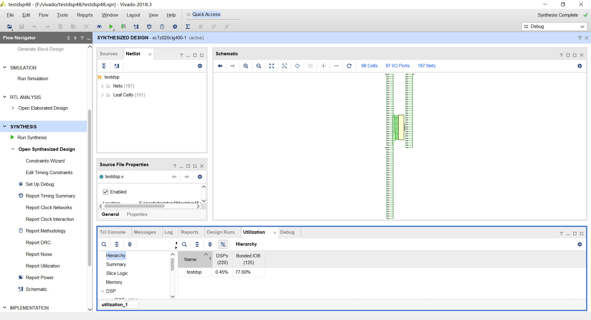
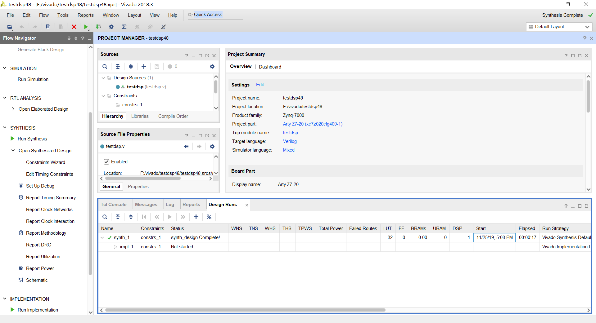

# testDSP48

本文项目用于测试arty-z7的加法器和乘法器资源

## 默认使用LUT

```verilog
module testdsp
(
  input  [31 : 0] a,
  input  [31 : 0] b,
  output [32 : 0] sum
);

  assign sum = a + b;
  
endmodule
```

有，LUT使用32个，一共有53200个，并显示了百分比：





## 使用dsp48

```verilog
(*use_dsp48 = "yes"*)

module testdsp
(
  input  [31 : 0] a,
  input  [31 : 0] b,
  output [32 : 0] sum
);

  assign sum = a + b;
  
endmodule
```

有0个LUT和1个DSP资源，一共220个DSP资源：





事实上，`(*use_dsp48 = "yes"*)`是可以放在module里面的，如：

```verilog
module testdsp
(
  input  [31 : 0] a,
  input  [31 : 0] b,
  input  [31 : 0] c,
  input  [31 : 0] d,
  output [32 : 0] sum,
  output [32 : 0] sum1
);

  (*use_dsp48 = "yes"*) wire [32 : 0]  sum1;
  wire [32 : 0] sum;
  
  assign sum = a + b;
  assign sum1 = c + d;
  
endmodule
```


